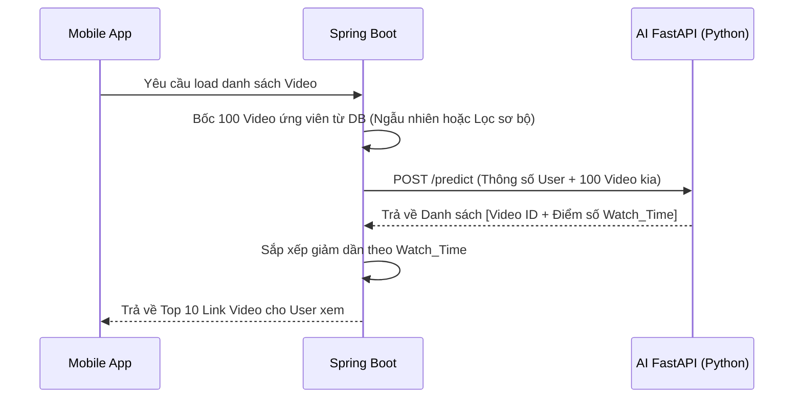
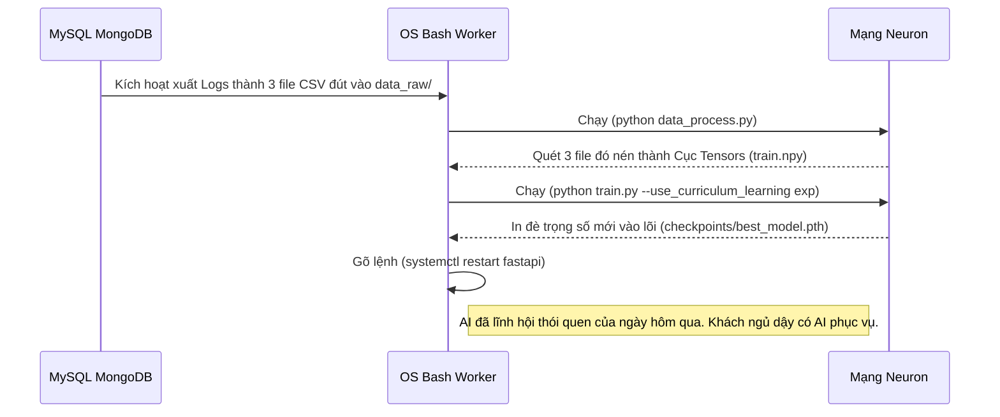

# Toàn Tập Kiến Trúc Tích Hợp AI: Suy Đoán (Online) & Học Tăng Cường (Offline)

Tài liệu này là "Kim chỉ nam" cho đội ngũ Backend (Spring Boot/Java) và Data (Python). Nó bao quát toàn bộ vòng đời tồn tại của AI Recommender System, chia làm 2 giai đoạn bắt buộc phải có để hệ thống khép kín:

- **PHẦN 1 - Luồng Online (Ban Ngày):** Gọi API để chấm điểm Video trước khi đưa lên màn hình.
- **PHẦN 2 - Luồng Offline (Ban Đêm):** Thu gom Log thực tế để bơm cho AI Học tăng cường (Incremental Learning).

---

## PHẦN 1: LUỒNG ONLINE - GỌI API SUY LUẬN (INFERENCE)

Mục đích: AI đóng vai trò làm cỗ máy "Chấm Điểm". Spring Boot đem video chưa biết sống chết ra sao ném cho AI, AI nhả số giây phán đoán.



### 1.1 Khối Request gửi cấu hình (Từ Spring Boot -> Python)

**URL:** `POST http://<ai-server-ip>:8000/predict` | **Content-Type:** `application/json`

_(Spring Boot **BẮT BUỘC** phải rã thông tin từ DB ra và bọc thành JSON cấu trúc dưới đây, AI chỉ ăn những con số này)_

```json
{
  "user_profile": {
    "user_id": 0, // Luôn truyền 0 cho User Mới (Để bypass Embedding Network)
    "active_degree": 2, // Độ năng động: 0 (Mới đăng ký), 1 (Thi thoảng), 2, 3 (Nghiện app)
    "is_live_streamer": 0, // User này có livestream không: 0 (Không), 1 (Có)
    "is_video_author": 1, // User này có hay post video không: 0 (Không), 1 (Có)
    "follow_user_num_range": 3, // Tầm khoảng (range) follow người khác. Vd: 0 (0-10ng), 1(10-50ng)...
    "fans_user_num_range": 1, // Tầm khoảng (range) số follower họ có
    "register_days_range": 4 // Độ tuổi tài khoản (Vd: 3 là trên 1 năm)
  },
  "video_candidates": [
    {
      "candidate_id": 10005, // ID Gốc của Video trong Table MySQL (Dùng để Tí nữa map link URL mp4)
      "item_id": 0, // Truyền 0 với các video mới (Để tránh sai số do chưa từng huấn luyện ID này)
      "duration_seconds": 45.5, // SIÊU QUAN TRỌNG: Độ dài tổng của video (Tính bằng giây/Float). AI dùng số này làm mốc.
      "feat0": 15, // Mã Thể Loại 1 (Ví dụ: Thể thao = 15). Cần lập 1 bảng Enum dưới Java
      "feat1": 0, // Mã Thể Loại 2 (Không có thì truyền 0)
      "feat2": 0, // Mã Thể Loại 3
      "feat3": 0 // Mã Thể Loại 4
    },
    {
      "candidate_id": 10006,
      "item_id": 0,
      "duration_seconds": 15.0,
      "feat0": 8, // (Ví dụ: Chó mèo = 8)
      "feat1": 2, // (Ví dụ: Hài hước = 2)
      "feat2": 0,
      "feat3": 0
    }
  ]
}
```

### 1.2 Khối Response trả về (Từ AI -> Spring Boot)

Trong khối Request trên hoàn toàn không có `watch_time`, bởi vì chính AI sẽ là thằng tính toán và trả ra trường đó.

```json
{
  "status": "success",
  "predictions": [
    {
      "candidate_id": 10005,
      "predicted_watch_time": 25.4 // Điểm dự báo: Sẽ nán lại xem 25.4s / 45s => Cho lên đầu
    },
    {
      "candidate_id": 10006,
      "predicted_watch_time": 1.2 // Điểm dự báo: 1.2s / 15s là bị vuốt lướt qua luôn => Bỏ xuống cuối
    }
  ]
}
```

---

## PHẦN 2: LUỒNG OFFLINE - THU THẬP LOG CHO AI HỌC TĂNG CƯỜNG (INCREMENTAL LEARNING)

Dù Spring Boot trộn video theo AI hay trộn bừa (Random), thì quá trình "Ăn nằm trên App" của User chính là nguồn sữa để nuôi AI lớn lên. **App điện thoại phải bắt đồng hồ bấm giờ ngầm trên từng video**. Quá trình này **KHÔNG gọi API**, nó đổ xuống File Log.

### 2.1 Yêu Cầu Thu Thập Log Trả Về Máy Chủ (Tracking Event)

Khi user lướt tay trên điện thoại, đội Client (Android/iOS) phải gửi lệnh `POST /api/track` về Java. Spring Boot gom cục đống Log đó, đến **2h sáng xuất ra thành các file CSV** (Lưu vào ổ cứng thư mục `data/data_raw/`).

Dưới đây là đặc tả các CỘT (Columns) bắt buộc mà đội Backend phải xuất ra trong file `big_matrix_processed.csv` (File chứa thao tác vuốt):

| Tên Cột              | Kiểu Dữ Liệu | Giải Thích Rất Chi Tiết Cấu Trúc Bắt Buộc                                                                                                                                                                                                                                                                                                                                                                                                          | Tầm Quan Trọng         |
| -------------------- | ------------ | -------------------------------------------------------------------------------------------------------------------------------------------------------------------------------------------------------------------------------------------------------------------------------------------------------------------------------------------------------------------------------------------------------------------------------------------------- | ---------------------- |
| `user_id`            | Integer      | ID độc nhất của User trong Database của bạn. Lần này gửi ID thật. Vd: `491`.                                                                                                                                                                                                                                                                                                                                                                       | Định danh Nhúng AI     |
| `item_id`            | Integer      | ID độc nhất của Video. Gửi ID thật. Vd: `15392`.                                                                                                                                                                                                                                                                                                                                                                                                   | Định danh Nhúng AI     |
| `timestamp`          | Long         | Thời điểm User quẹt hoặc tim (Epoch time).                                                                                                                                                                                                                                                                                                                                                                                                         | Theo dõi chuỗi lịch sử |
| `duration_normed`    | Float        | **(Đề bài)** Tổng thời lượng gốc của cái video đó tính bằng giây (VD: video dài 30.5s -> ghi `30.5`).                                                                                                                                                                                                                                                                                                                                              | **BẮT BUỘC**           |
| `watch_ratio_normed` | Float        | **(ĐÁP ÁN NÒNG CỐT CỦA MẠNG A.I)** Mô hình GR tối ưu hàm lỗi (Huber Loss) dựa trên cột này. <br><br>**Công thức tính ở Java:** `Số giây cắm mặt xem trên app / Tổng độ dài Video`. <br><br>_VD 1: User bị nhét 1 video Random nấu ăn dở ẹc dài 40s. Gạt màn hình qua sau 1.2s. Log xuất ra `1.2/40 = 0.03` => AI chê._ <br>_VD 2: Video dài 20s, xem cuốn quá coi hết, cộng coi lại thêm lần nữa mất 30s. Log xuất `30/20 = 1.5` => AI rất thích._ | **MẠCH MÁU CỦA AI**    |

**Bên cạnh file thao tác đó, Spring Boot xuất kèm 2 file Danh mục (Từ điển) y hệt data lúc Push Online:**

- `item_categories.csv` (Chứa `item_id` cột trái, mảng list mã Thể loại `[feat0, feat1...]` bên phải).
- `user_features.csv` (Chứa `user_id` cột trái, và các Level ranh giới `active_degree`, `follower`... bên phải).

### 2.2 Sơ Đồ Hệ Thống Tự Động Hóa Học Ban Đêm (Nightly Cronjob)

Đến đoạn này, Data Engineer/DevOps chỉ cần bấm nút để luồng ống tự động chạy:



Đời sống hằng ngày, Tài năng / Kỹ năng, Hài hước / Giải trí, Làm đẹp / Mỹ phẩm, Ẩm thực / Nấu ăn, Thú cưng / Động vật, Âm nhạc / Ca hát, Nhảy / Vũ đạo, Thời trang / Quần áo, Trò chơi / Game, Hoạt hình / Anime, Kiến thức / Giáo dục, Nghệ thuật / Thủ công, Thể thao / Thể hình, Du lịch / Phong cảnh, Công nghệ / Đồ chơi, Ô tô / Phương tiện, Tin tức / Phóng sự, Cha mẹ / Trẻ em, Tình cảm / Tâm sự, Chụp ảnh / Phim, Sức khỏe / Y học, Tài chính / Kinh tế, Văn hóa / Lịch sử, Tôn giáo / Triết học, Thiên nhiên / Sinh vật, Việc làm / Công sở, Quân sự / Quốc phòng, Bất động sản / Nhà cửa, Phim ảnh / Sân khấu, PK / Livestream tương tác

### TỔNG KẾT RÕ RÀNG NHẤT:

- Mảng bạn gửi trong JSON ở Mục 1 (Ban Ngày) **KHÔNG ĐƯỢC CHỨA ĐÁP ÁN (watch_time)**, vì gửi cho nó đi đo đố nó.
- File CSV bạn xuất ra ở Mục 2 (Ban Đêm) **KHÔNG THỂ THIẾU ĐÁP ÁN (watch_ratio_normed)**, tính tới từng dấu phết thập phân, vì AI cần đáp án mới biết đường trừ điểm hay cộng điểm cho user/video đó trong tương lai!
  -1 0 Không xác định / Trống Unknown / Padding
  0 1 Đời sống hằng ngày Life / Daily
  1 2 Tài năng / Kỹ năng Talent
  2 3 Hài hước / Giải trí Humor / Entertainment
  3 4 Làm đẹp / Mỹ phẩm Beauty / Cosmetics
  4 5 Ẩm thực / Nấu ăn Food / Cooking
  5 6 Thú cưng / Động vật Pets / Animals
  6 7 Âm nhạc / Ca hát Music
  7 8 Nhảy / Vũ đạo Dance
  8 9 Thời trang / Quần áo Fashion
  9 10 Trò chơi / Game Games
  10 11 Hoạt hình / Anime Anime / Cartoon
  11 12 Kiến thức / Giáo dục Knowledge
  12 13 Nghệ thuật / Thủ công Art
  13 14 Thể thao / Thể hình Sports
  14 15 Du lịch / Phong cảnh Travel
  15 16 Công nghệ / Đồ chơi Technology
  16 17 Ô tô / Phương tiện Cars
  17 18 Tin tức / Phóng sự News
  18 19 Cha mẹ / Trẻ em Baby / Parenting
  19 20 Tình cảm / Tâm sự Relationship
  20 21 Chụp ảnh / Phim Photography
  21 22 Sức khỏe / Y học Health
  22 23 Tài chính / Kinh tế Finance
  23 24 Văn hóa / Lịch sử Culture
  24 25 Tôn giáo / Triết học Religion
  25 26 Thiên nhiên / Sinh vật Nature
  26 27 Việc làm / Công sở Job / Work
  27 28 Quân sự / Quốc phòng Military
  28 29 Bất động sản / Nhà cửa Real Estate
  29 30 Phim ảnh / Sân khấu Movies
  30 31 PK / Livestream tương tác Live Interaction
